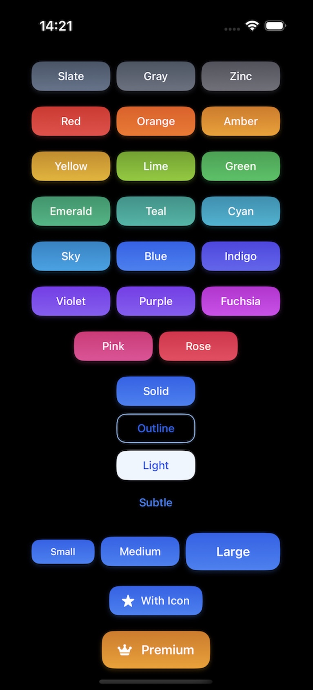

# TailwindButtonKit - SwiftUI 的 TailwindCSS 风格按钮组件库

[](https://swift.org)
[](https://developer.apple.com)
[](https://opensource.org/licenses/MIT)

一个受 TailwindCSS 启发的 SwiftUI 按钮组件库，提供完整的 Tailwind 配色方案、多种尺寸和样式变体，支持悬停效果和动画。




## 特性

- **完整的 TailwindCSS 配色** - 22 种标准颜色，每种颜色 10 个色阶
- **多种样式** - 实心、描边、浅色和极简四种变体
- **三种尺寸** - 小号、中号(默认)和大号
- **图标支持** - 轻松集成 SF Symbols
- **悬停效果** - 精美的交互状态动画
- **深色模式** - 自动适配系统外观

## 安装

### Swift Package Manager

在 `Package.swift` 中添加依赖：

```swift
dependencies: [
    .package(url: "https://github.com/swiftuihome/TailwindButtonKit.git", from: "1.0.3")
]
```

或在 Xcode 中直接添加：
1. 选择 File → Add Packages...
2. 输入仓库地址：`https://github.com/swiftuihome/TailwindButtonKit.git`
3. 选择您偏好的版本规则

## 使用指南

### 基础按钮

```swift
import TailwindButtonKit

struct ContentView: View {
    var body: some View {
        TailwindButton("点击我") {
            print("按钮被点击！")
        }
    }
}
```

### 带图标按钮

```swift
TailwindButton("保存", icon: "square.and.arrow.down") {
    print("保存成功！")
}
```

### 自定义按钮

```swift
TailwindButton("删除",
              icon: "trash",
              size: .large,
              style: .outline,
              color: .red) {
    print("删除项目！")
}
```

### 给按钮指定色阶
```swift
TailwindButton("深色按钮", color: .indigo, shade: .s900) {}
```

## 可用颜色

TailwindButtonKit 包含所有 TailwindCSS 标准颜色：

| 颜色名称 | 预览 |
|------------|---------|
| slate |  |
| gray |  |
| zinc |  |
| neutral |  |
| stone |  |
| red |  |
| orange |  |
| amber |  |
| yellow |  |
| lime |  |
| green |  |
| emerald |  |
| teal |  |
| cyan |  |
| sky |  |
| blue |  |
| indigo |  |
| violet |  |
| purple |  |
| fuchsia |  |
| pink |  |
| rose |  |

## 按钮样式

### 实心(默认)
```swift
TailwindButton("实心", style: .solid) {}
```

### 描边
```swift
TailwindButton("描边", style: .outline) {}
```

### 浅色
```swift
TailwindButton("浅色", style: .light) {}
```

### 极简
```swift
TailwindButton("极简", style: .subtle) {}
```

## 按钮尺寸

### 小号
```swift
TailwindButton("小号", size: .small) {}
```

### 中号(默认)
```swift
TailwindButton("中号", size: .medium) {}
```

### 大号
```swift
TailwindButton("大号", size: .large) {}
```

## 系统要求

- iOS 17.0+ / macOS 14.0+ / watchOS 10.0+ / tvOS 17.0+
- Swift 5.9+
- Xcode 16+

## 参与贡献

欢迎贡献代码！如有任何改进建议或错误修复，请提交 issue 或 pull request。

## 开源协议

TailwindButtonKit 采用 MIT 开源协议。详情请见 [LICENSE](LICENSE) 文件。
